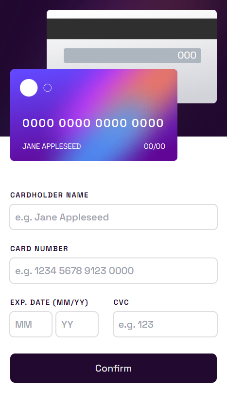

# Frontend Mentor - Interactive card details form solution

This is a solution to the [Interactive card details form challenge on Frontend Mentor](https://www.frontendmentor.io/challenges/interactive-card-details-form-XpS8cKZDWw).

## Table of contents

-   [Overview](#overview)
    -   [Screenshot](#screenshot)
    -   [Links](#links)
-   [My process](#my-process)
    -   [Built with](#built-with)
    -   [What I learned](#what-i-learned)
-   [Author](#author)

## Overview

### Screenshot


<div style="text-align:centerd">
  </img>
</div>

### Links

-   Solution URL: [Github](https://github.com/Chiragdbb/Interactive-Card-Details)
-   Live Site URL: [Here](https://interactive-card-details-chiragdbb.netlify.app/)

## My process

### Built with

-   Flexbox
-   Mobile-first workflow
-   [React](https://reactjs.org/) - JS library
-   [Vite](https://vitejs.dev/) - Development Environment
-   [Tailwind](https://tailwindcss.com/) - CSS framework

### What I learned

Creating the format of a credit card number (space after every 4 numbers) was the most difficult task in this project, which led me to find other solutions then what came to my mind first.

In the end I went with regex because it was the easiest to implement. 

```js
cardData.cardNumber
	.replace(/\s?/g, "")
	.replace(/(\d{4})/g, "$1 ")
	.trim();
```
In this we first replace all spaces in the input field and then add a whitespace after every 4 group of numbers.

## Author

-   Frontend Mentor profile - [@chiragdbb](https://www.frontendmentor.io/profile/Chiragdbb)
